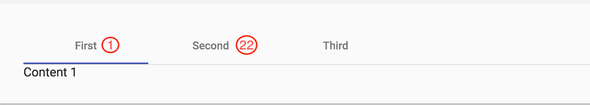

# Material - Como adicionar matbadge para label da MatTab

```html
<mat-tab>
    <ng-template matTabLabel>
        <span matBadge="5" matBadgeOverlap="false">My header</span>
    </ng-template>
    Your tab content goes here
</mat-tab>
```
